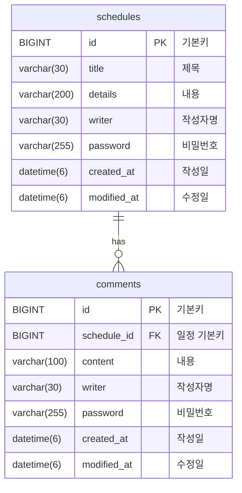

<!-- Improved compatibility of back to top link: See: https://github.com/othneildrew/Best-README-Template/pull/73 -->
<a id="readme-top"></a>
<!--
*** 
-->

<!-- PROJECT SHIELDS -->
<!--
*** 
-->
[![Contributors][contributors-shield]][contributors-url]
[![Forks][forks-shield]][forks-url]
[![Stargazers][stars-shield]][stars-url]
[![Issues][issues-shield]][issues-url]
[![Unlicense License][license-shield]][license-url]
[![LinkedIn][linkedin-shield]][linkedin-url]

<!-- PROJECT LOGO -->
<br />
<div align="center">
  <h3 align="center">일정 관리 앱</h3>
</div>

<!-- 목차 -->
<details>
  <summary>목차</summary>
  <ol>
    <li>
      <a href="#about-the-project">About The Project</a>
      <ul>
        <li><a href="#built-with">Built With</a></li>
      </ul>
    </li>
    <li>
      <a href="#getting-started">Getting Started</a>
      <ul>
        <li><a href="#prerequisites">Prerequisites</a></li>
        <li><a href="#installation">Installation</a></li>
      </ul>
    </li>
    <li><a href="#usage">Usage</a></li>
    <li><a href="#roadmap">Roadmap</a></li>
    <li><a href="#contributing">Contributing</a></li>
    <li><a href="#license">License</a></li>
    <li><a href="#contact">Contact</a></li>
    <li><a href="#acknowledgments">Acknowledgments</a></li>
  </ol>
</details>

<!-- API 명세서 -->
## API 명세서

### 일정 생성(일정 작성하기)
Request 
|Method|URL|Content-Type|
|:-:|:-:|:-:|
|POST|schedules|application/json|
* Body:
  ```json
  {
	"title": "내 생일",
	"details": "부모님한테 감사하기",
	"writer": "기찬",
	"password": "1234"
  }
  ```
Response 
* Status Code: 201(생성 성공)
* Body:
  ```json
  {
    "id": 28,
    "title": "내 생일",
    "details": "부모님한테 감사하기",
    "writer": "기찬",
    "createdAt": "2026-02-03T18:22:04.1486554",
    "modifiedAt": "2026-02-03T18:22:04.1486554"
  }
  ```
* Status Code: 400(실패)
* Body:
  ```json
  {
    "isOk": false,
    "message": "title을 30 이하로 입력해 주세요"
  }
  ```
### 전체 일정 조회
Request 
|Method|URL|Content-Type|
|:-:|:-:|:-:|
|GET|schedules|application/json|

Response 
Status Code: 200(성공)
* Body:
  ```json
  [
    {
        "id": 28,
        "title": "내 생일",
        "details": "부모님한테 감사하기",
        "writer": "기찬",
        "createdAt": "2026-01-30T17:10:31.360658",
        "modifiedAt": "2026-02-02T13:03:28.874428"
    },
    {
        "id": 30,
        "title": "친구 생일",
        "details": "태어나줘서 고맙다",
        "writer": "친구1",
        "createdAt": "2026-01-30T17:10:44.51915",
        "modifiedAt": "2026-01-30T17:10:44.51915"
    }
  ]
  ```
### 선택 일정 조회
Request 
|Method|URL|Content-Type|PathVariable|
|:-:|:-:|:-:|:-:|
|GET|schedules/{id}|application/json|id|

Response 
Status Code: 200(성공)
* Body:
  ```json
  {
    "id": 28,
    "title": "내 생일",
    "details": "부모님한테 감사하기",
    "writer": "기찬",
    "comments": [
        {
            "id": 1,
            "content": "축하한다",
            "writer": "엄마",
            "scheduleId": 30,
            "createdAt": "2026-02-02T15:20:44.07406",
            "modifiedAt": "2026-02-02T15:20:44.07406"
        },
        {
            "id": 2,
            "content": "고맙다",
            "writer": "아빠",
            "scheduleId": 30,
            "createdAt": "2026-02-02T15:20:51.237276",
            "modifiedAt": "2026-02-02T15:20:51.237276"
        }
    ],
    "createdAt": "2026-01-30T17:10:44.51915",
    "modifiedAt": "2026-01-30T17:10:44.51915"
  }
  ```
### 선택한 일정 수정
Request 
|Method|URL|Content-Type|PathVariable|
|:-:|:-:|:-:|:-:|
|PATCH|schedules/{id}|application/json|id|
* Body:
  ```json
  {
	"title": "사실 생일 아니었음",
	"writer": "사실 기찬이도 아니었음",
	"password": "1234"
  }
  ```
Response 
* Status Code: 200(성공)
* Body:
  ```json
  {
    "id": 28,
    "title": "사실 생일 아니었음",
    "details": "부모님한테 감사하기",
    "writer": "사실 기찬이도 아니었음",
    "createdAt": "2026-02-03T18:22:04.1486554",
    "modifiedAt": "2026-02-03T18:22:04.1486554"
  }
  ```
* Status Code: 400(실패)
* Body:
  ```json
  {
    "isOk": false,
    "message": "title을 30 이하로 입력해 주세요"
  }
  ```
### 선택한 일정 삭제
Request 
|Method|URL|Content-Type|PathVariable|
|:-:|:-:|:-:|:-:|
|DELETE|schedules/{id}|application/json|id|
* Body:
  ```json
  {
	"password": "1234"
  }
  ```
Response 
* Status Code: 204(성공)


<p align="right">(<a href="#readme-top">back to top</a>)</p>


<!-- ERD -->
## ERD



<p align="right">(<a href="#readme-top">back to top</a>)</p>


<!-- 할 일 -->
## 할 일

- [x] Lv 0. API 명세, ERD 작성, 개발환경 세팅
    - [x] Spring 프로젝트 생성
    - [x] 깃허브 레포 생성
    - [x] 프로젝트 깃허브 레포 연결
    - [x] 리드미 초안 작성
    - [x] API 명세서 작성하기
    - [x] ERD 작성하기
    - [x] MySQL 연결
- [ ] Lv 1. 일정 생성
    - [ ] 일정 엔티티 만들기
    - [ ] 일정 생성 리퀘스트 및 리스폰스 DTO 만들기
    - [ ] 일정 레포 만들기
    - [ ] 일정 서비스 만들고 저장 기능 추가
    - [ ] 일정 컨트롤러 만들고 일정 등록 API 추가
    - [ ] 일정 생성 테스트
- [ ] Lv 2. 일정 조회
    - [ ] 전체 일정 조회 리퀘스트 및 리스폰스 DTO 만들기
    - [ ] 일정 레포에 작성자명으로 수정일 기준 내림차순 정렬 해서 조회하는 메소드 추가
    - [ ] 전체 일정 조회 서비스 메소드 추가
    - [ ] 전체 일정 조회 컨트롤러 메소드 추가
    - [ ] 선택 일정 조회 리퀘스트 및 리스폰스 DTO 만들기
    - [ ] 선택 일정 조회 서비스 메소드 추가
    - [ ] 선택 일정 조회 컨트롤러 메소드 추가
- [ ] Lv 3. 일정 수정
    - [ ] 선택 일정 수정 리퀘스트 및 리스폰스 DTO 만들기
    - [ ] 선택 일정 수정 서비스 메소드 추가
    - [ ] 선택 일정 수정 컨트롤러 메소드 추가
    - [ ] 일치 여부 검증 로직 추가
- [ ] Lv 4. 일정 삭제
    - [ ] 선택 일정 삭제 서비스 메소드 추가
    - [ ] 선택 일정 삭제 컨트롤러 메소드 추가
- [ ] Lv 5. 댓글 생성(댓글 작성하기)
    - [ ] 댓글 엔티티 만들기
    - [ ] 댓글 생성 리퀘스트 및 리스폰스 DTO 만들기
    - [ ] 댓글 레포 만들기
    - [ ] 댓글 서비스 만들고 저장 기능 추가
    - [ ] 댓글 컨트롤러 만들고 댓글 등록 API 추가
    - [ ] 댓글 개수 10개 제한 로직 추가
    - [ ] 댓글 생성 테스트
- [ ] Lv 6. 일정 단건 조회 업그레이드
    - [ ] 댓글 조회 리스폰스 DTO 만들기
    - [ ] 선택 일정 조회 리스폰스 DTO 수정
    - [ ] 선택 일정 조회 서비스 메소드 수정
- [ ] Lv 7. 유저의 입력에 대한 검증 수행
    - [ ] 간이 벨리데이션 메소드 추가
    - [ ] 필수값 체크
    - [ ] 길이 체크

[open issues](https://github.com/thetana/CalendarProject/issues)

<p align="right">(<a href="#readme-top">back to top</a>)</p>


<!-- CONTRIBUTING -->
## Contributing

### Top contributors:

<a href="https://github.com/thetana/CalendarProject/graphs/contributors">
  
</a>

<p align="right">(<a href="#readme-top">back to top</a>)</p>


<!-- CONTACT -->
## Contact

[성기찬](https://www.instagram.com/) - zxsa13577@gmail.com

Project Link: [https://github.com/thetana/CalendarProject](https://github.com/thetana/CalendarProject)

<p align="right">(<a href="#readme-top">back to top</a>)</p>


<!-- ACKNOWLEDGMENTS -->
## 도움 받은 링크

다음과 같은 링크들로 부터 도움을 받아 감사의 인사를 전합니다

* [최고의 리드미 템플릿](https://github.com/othneildrew/Best-README-Template)

<p align="right">(<a href="#readme-top">back to top</a>)</p>


<!-- MARKDOWN LINKS & IMAGES -->
<!-- https://www.markdownguide.org/basic-syntax/#reference-style-links -->
[contributors-shield]: https://img.shields.io/github/contributors/thetana/CalendarProject.svg?style=for-the-badge
[contributors-url]: https://github.com/thetana/CalendarProject/graphs/contributors
[forks-shield]: https://img.shields.io/github/forks/thetana/CalendarProject.svg?style=for-the-badge
[forks-url]: https://github.com/thetana/CalendarProject/network/members
[stars-shield]: https://img.shields.io/github/stars/thetana/CalendarProject.svg?style=for-the-badge
[stars-url]: https://github.com/thetana/CalendarProject/stargazers
[issues-shield]: https://img.shields.io/github/issues/thetana/CalendarProject.svg?style=for-the-badge
[issues-url]: https://github.com/thetana/CalendarProject/issues
[license-shield]: https://img.shields.io/github/license/thetana/CalendarProject.svg?style=for-the-badge
[license-url]: https://github.com/thetana/CalendarProject/blob/master/LICENSE.txt
[linkedin-shield]: https://img.shields.io/badge/-LinkedIn-black.svg?style=for-the-badge&logo=linkedin&colorB=555
[linkedin-url]: https://linkedin.com/in/thetana
[product-screenshot]: images/screenshot.png
